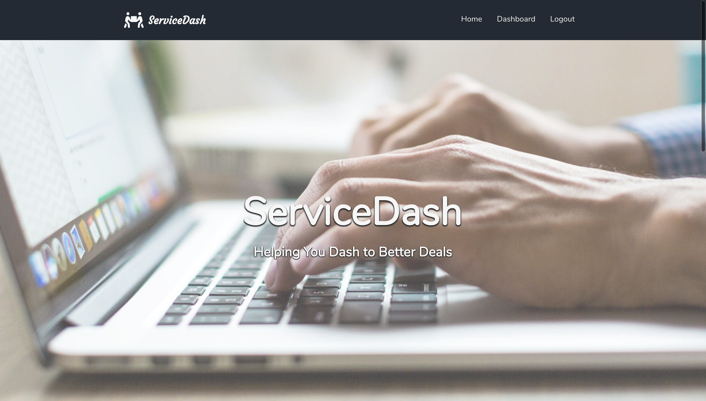
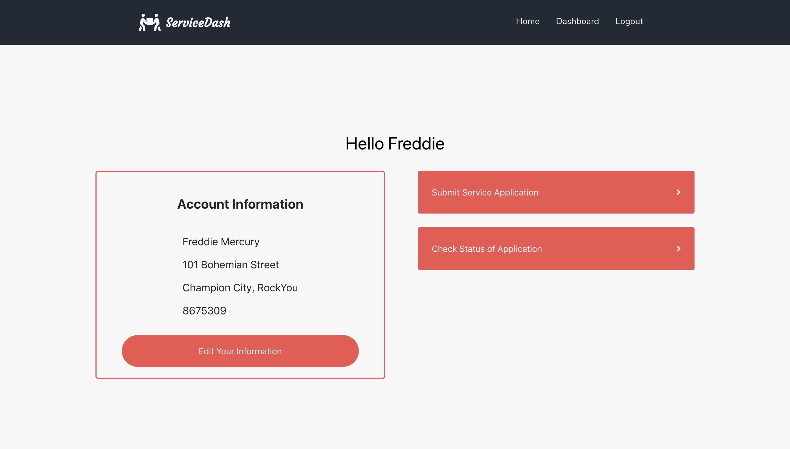
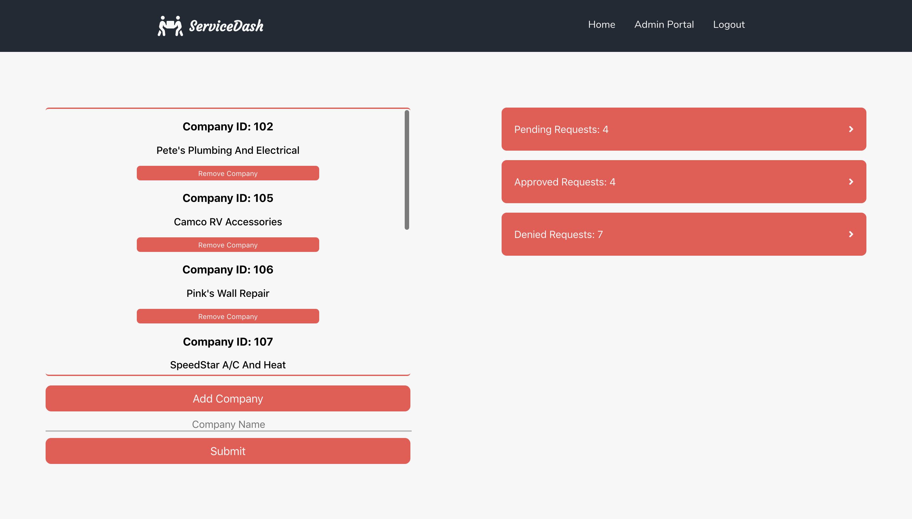

## ServiceDash

ServiceDash allows users to sign up, submit service request applications, and admins are able to assign those applicaitons to companies that meet the needs of the users request.

http://www.service-dash.com/

### Below is the landing page.

### This is the login view. When users sign in, a link will be conditionally rendered based on whether that user is an admin or not.

### On the user side, the users are able to submit a service application, check the status of the applications submitted, and edit account information.

### The admin side allows access to add or remove companies partnered with them and check application sent in by users.

